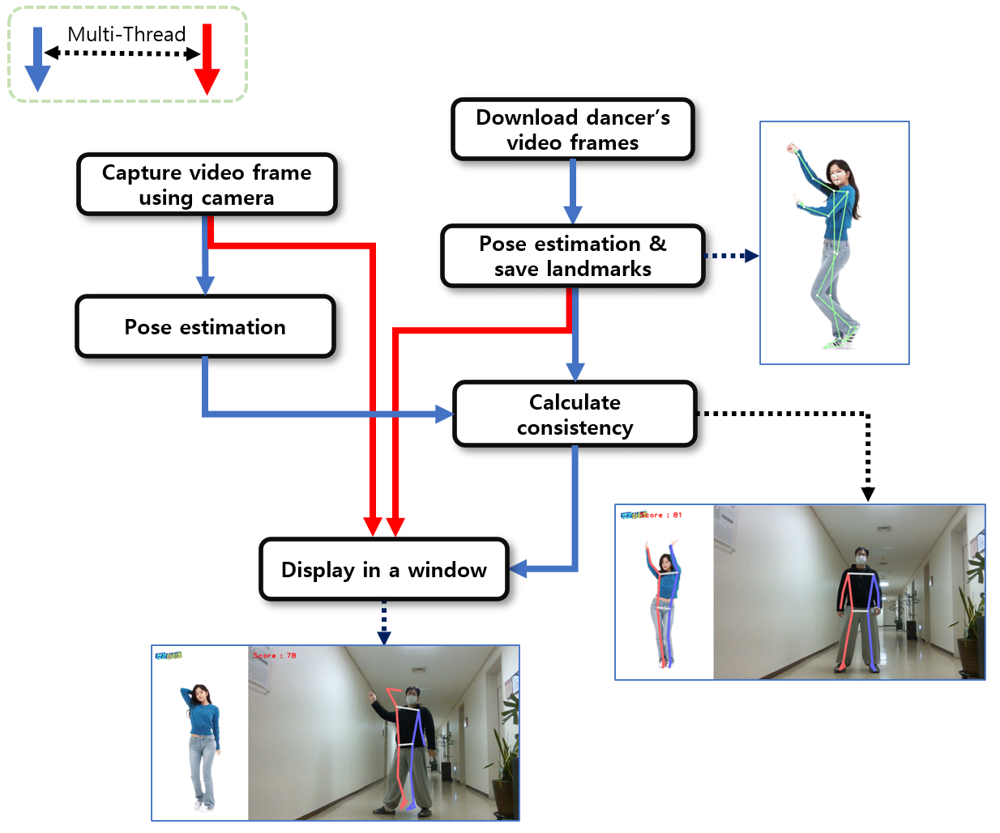
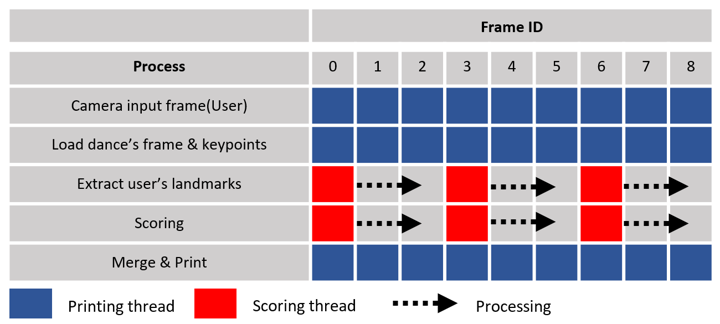

# Dance Practice System Using Deep Learning Pose Estimation

---

### **Overview**
This project presents an adaptable dance practice system powered by deep learning-based pose estimation algorithms. By using MediaPipe’s lightweight pose estimation model, the system can process virtually any choreography video, downloaded directly from platforms like YouTube, and make it usable for practice. The system leverages multithreading techniques to ensure smooth performance with high FPS and real-time scoring, even on devices with limited computational resources.

---

### **Features**
1. **Universal Choreography Compatibility**:
   - Supports downloading and processing any online choreography video, providing unparalleled flexibility for dance practice.
2. **Efficient Pose Estimation**:
   - Utilizes MediaPipe’s BlazePose, a lightweight and fast deep learning model, to extract precise keypoints from dancers.
3. **Real-Time Similarity Scoring**:
   - Compares user poses to dancer poses using cosine similarity, delivering intuitive feedback.
4. **Optimized Performance via Multithreading**:
   - Achieves high FPS for smooth video playback and real-time scoring, even on low-resource devices.

---

### **System Flow**
| **System Flowchart** |
|-----------------------|
|  |

1. Download any choreography video using the crawling feature.
2. Extract keypoints for each frame of the video using BlazePose.
3. Capture the user’s pose in real time via webcam.
4. Calculate pose similarity scores dynamically.
5. Display the choreography, user video, pose guide, and scores in a synchronized interface.

---

### **Key Technologies**
- **BlazePose (MediaPipe)**:
  - A lightweight deep learning-based pose estimation framework that delivers fast and accurate results, making it ideal for real-time applications.
- **Multithreading**:
  - Parallel processing for output rendering and similarity scoring, ensuring seamless performance.
- **Cosine Similarity**:
  - Robust scoring mechanism that is invariant to scale and position, focusing solely on pose alignment.

| **Threading Workflow** |
|-------------------------|
|  |

---

### **How It Works**
1. **Choreography Processing**:
   - Users can input URLs of online dance videos, which are downloaded and processed to extract dancer keypoints.
2. **Real-Time Practice**:
   - The system visualizes pose guides from the choreography while capturing and analyzing user poses dynamically.
3. **Performance Optimization**:
   - Multithreading separates computationally intensive scoring tasks from rendering tasks, ensuring a smooth and responsive experience at high FPS.

---

### **Results**
1. **Wide Applicability**:
   - Works seamlessly with any dance video, allowing users to practice diverse choreographies from platforms like YouTube or TikTok.
2. **High Efficiency**:
   - Delivers high FPS video playback and real-time scoring on devices ranging from high-performance CPUs to low-resource environments.
3. **Accurate Feedback**:
   - Consistently evaluates user performance with intuitive and precise similarity scores.

---

### **Future Directions**
- Enhance the system to support multi-user practice sessions.
- Implement pose correction feedback to improve learning outcomes.
- Further optimize for ultra-low-resource devices or embedded systems.

---

This system empowers dancers of all levels to practice their favorite choreographies with precision and efficiency. Feel free to contribute, suggest improvements, or raise issues for further development!
